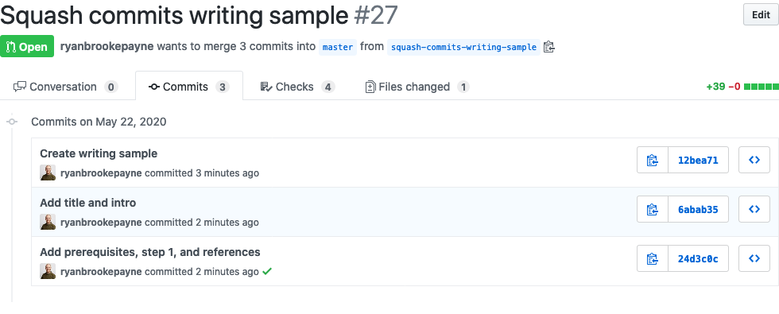
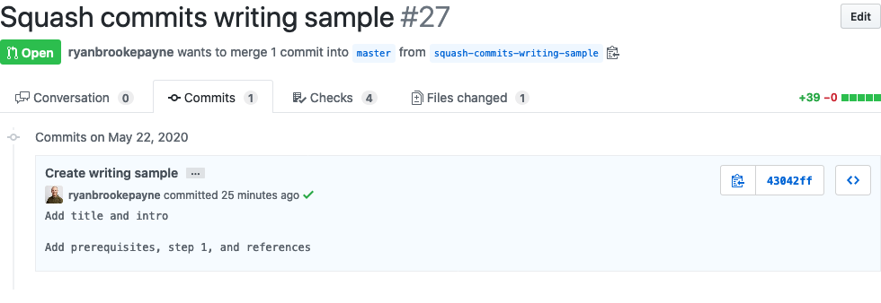

# Squashing Multiple Git Commits Into a Single Commit

This guide will show you how to squash multiple commits together into one single commit using [git-rebase](https://git-scm.com/docs/git-rebase).

Before | After
--- | ---
 | 

### Prerequisites

- You have experience with the [Git](https://git-scm.com/) version control system
- You have basic experience with [GitHub](https://github.com/) and have a repository setup
- You have basic experience with [Vim](https://www.vim.org/)

## Step 1—Squashing the Commits with Git Rebase

In order to squash commits locally, run the git-rebase command with the desired number of commits to squash—in this case "3".

```bash
git rebase -i HEAD~3
```

You should now see the following terminal output.

```bash
pick 12bea71 Create writing sample
pick 6abab35 Add title and intro
pick 24d3c0c Add prerequisites, step 1, and references

# Rebase 70a4a97..24d3c0c onto 70a4a97 (3 commands)
#
# Commands:
# p, pick <commit> = use commit
# r, reword <commit> = use commit, but edit the commit message
# e, edit <commit> = use commit, but stop for amending
# s, squash <commit> = use commit, but meld into previous commit
# f, fixup <commit> = like "squash", but discard this commit's log message
# x, exec <command> = run command (the rest of the line) using shell
# d, drop <commit> = remove commit
# l, label <label> = label current HEAD with a name
# t, reset <label> = reset HEAD to a label
# m, merge [-C <commit> | -c <commit>] <label> [# <oneline>]
# .       create a merge commit using the original merge commit's
# .       message (or the oneline, if no original merge commit was
# .       specified). Use -c <commit> to reword the commit message.
#
# These lines can be re-ordered; they are executed from top to bottom.
#
# If you remove a line here THAT COMMIT WILL BE LOST.
#
#       However, if you remove everything, the rebase will be aborted.
#
#
# Note that empty commits are commented out
```

Replace the word "pick" with "squash" at the beginning of the second and third lines. This will instruct Git to squash those two commits into the first one.

::: tip
See [Basic Vim commands - For getting started](https://coderwall.com/p/adv71w/basic-vim-commands-for-getting-started) if you're unfamiliar with how to edit Vim files.
:::

```diff
pick 12bea71 Create writing sample
- pick 6abab35 Add title and intro
- pick 24d3c0c Add prerequisites, step 1, and references
+ squash 6abab35 Add title and intro
+ squash 24d3c0c Add prerequisites, step 1, and references
```

Next, save your changes by doing the following.

1. Hit `escape` key on your keyboard
2. Type `:x`
3. Hit `enter` key on your keyboard

You should now see the following terminal output.

```bash
# This is a combination of 3 commits.
# This is the 1st commit message:

Create writing sample

# This is the commit message #1:

Add title and intro

# This is the commit message #2:

Add prerequisites, step 1, and references

# Please enter the commit message for your changes. Lines starting
# with '#' will be ignored, and an empty message aborts the commit.
#
# Date:      Fri May 22 16:29:07 2020 -0500
#
# interactive rebase in progress; onto 70a4a97
# Last commands done (3 commands done):
#    squash 6abab35 Add title and intro
#    squash 24d3c0c Add prerequisites, step 1, and references
# No commands remaining.
# You are currently rebasing branch 'squash-commits-writing-sample' on '70a4a97'.
#
# Changes to be committed:
#       new file:   technical-writing/samples/how-to-squash-multiple-git-commits-into-one.md
#
```

Save these changes by following the previous instructions (`escape`, `:x`, and `enter`). You should now see the following terminal output.

```bash
[detached HEAD 43042ff] Create writing sample
 Date: Fri May 22 16:29:07 2020 -0500
 1 file changed, 39 insertions(+)
 create mode 100644 technical-writing/samples/how-to-squash-multiple-git-commits-into-one.md
Successfully rebased and updated refs/heads/squash-commits-writing-sample.
```

## Step 2—Force Pushing the Squashed Commits

Now that you've squashed the changes locally, force push them to GitHub.

```bash
git push --force-with-lease
```

You should now see the following terminal output.

```bash
Enumerating objects: 8, done.
Counting objects: 100% (8/8), done.
Delta compression using up to 8 threads.
Compressing objects: 100% (5/5), done.
Writing objects: 100% (5/5), 873 bytes | 873.00 KiB/s, done.
Total 5 (delta 3), reused 0 (delta 0)
remote: Resolving deltas: 100% (3/3), completed with 3 local objects.
To github.com:ryanbrookepayne/ryanbrookepayne.git
 + 24d3c0c...43042ff squash-commits-writing-sample -> squash-commits-writing-sample (forced update)
```

And finally you should see your commits all squashed into one in GitHub.

---

### References

- [A Beginner’s Guide to Squashing Commits with Git Rebase](https://medium.com/@slamflipstrom/a-beginners-guide-to-squashing-commits-with-git-rebase-8185cf6e62ec)
